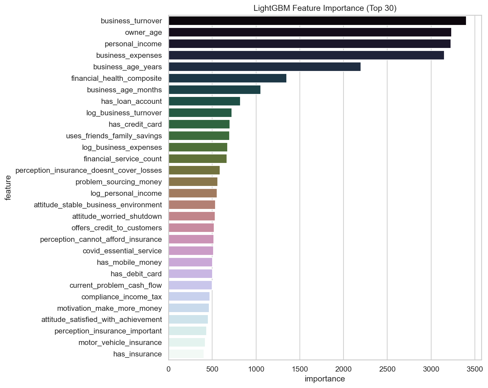

# Financial Prediction Model

Python ML workspace for the Data.org MSME Financial Health challenge: EDA, LightGBM training, and competition submissions.

| Folder | Description |
|--------|-------------|
| [`datasets/`](datasets/README.md) | Train, test, and variable definitions |
| [`eda/`](eda/README.md) | Exploratory analysis notebook and figures |
| [`models/`](models/README.md) | v3 training script, notebook, and saved model |
| [`submissions/`](submissions/README.md) | Competition prediction CSVs (v1–v3) |
| [`scripts/`](scripts/README.md) | Notebook build utilities (optional) |

---

## Current model

**LightGBM v3** — multiclass classifier with data-driven feature engineering. Train via [`models/financial_prediction_v3.py`](models/financial_prediction_v3.py) or [`models/financial_prediction_v3.ipynb`](models/financial_prediction_v3.ipynb).

| Artifact | Path |
|----------|------|
| Saved model | `models/financial_prediction_v3_model.pkl` |
| Test predictions | `submissions/financial_prediction_v3_submission.csv` |

---

## Key result (EDA benchmark)

| Metric | Value |
|--------|-------|
| OOF accuracy | 0.874 |
| OOF F1 (macro) | 0.805 |
| Macro ROC-AUC (OVR) | 0.944 |

Full charts and parameters: [`eda/`](eda/README.md).

### Model feature importance (LightGBM)



---

## Quick start

```bash
cd financial-prediction-model
pip install pandas numpy scikit-learn lightgbm matplotlib seaborn jupyter joblib scipy

jupyter notebook eda/comprehensive_eda.ipynb
python models/financial_prediction_v3.py
```

Run from this directory so `datasets/`, `models/`, and `submissions/` paths resolve correctly.
