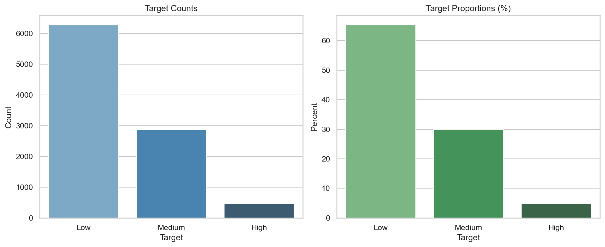
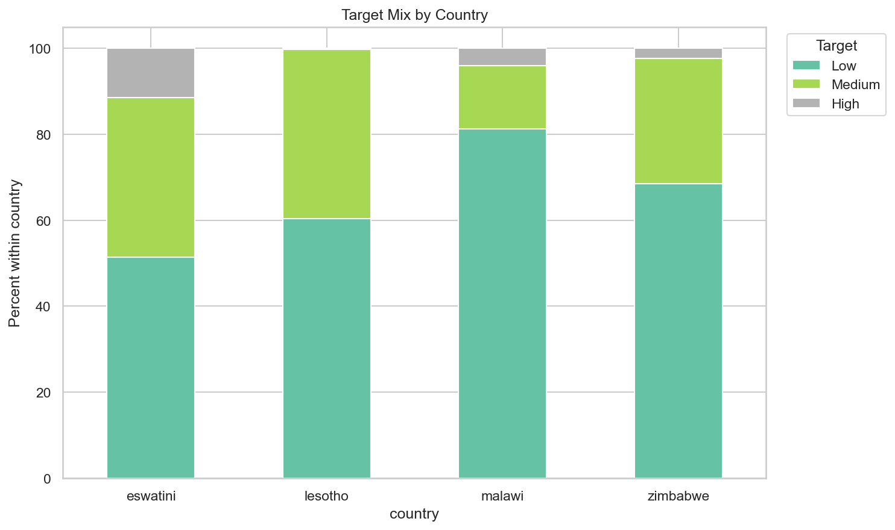

# Datasets

Competition CSVs for training and inference. Do not redistribute outside [Zindi](https://zindi.africa/) and [CC BY-SA 4.0](https://creativecommons.org/licenses/by-sa/4.0/) terms — see root [`CITATIONS.md`](../../CITATIONS.md).

| File | Rows | Description |
|------|------|-------------|
| `Train.csv` | 9,618 | Labeled MSME records (`Target`: Low / Medium / High) |
| `Test.csv` | — | Unlabeled holdout for submission |
| `VariableDefinitions.csv` | 39 | Column names and descriptions |

---

## Target distribution (training set)

| Class | Share (approx.) |
|-------|-----------------|
| Low | 65% |
| Medium | 30% |
| High | 5% |

Strong class imbalance — stratified cross-validation is recommended (see [`eda/decision_parameters_summary.csv`](../eda/decision_parameters_summary.csv)).



---

## Geography

Businesses span **Eswatini**, **Lesotho**, **Malawi**, and **Zimbabwe**. Country is a meaningful predictor (target mix differs by market).



---

## Usage

```python
import pandas as pd

train = pd.read_csv("datasets/Train.csv")
test = pd.read_csv("datasets/Test.csv")
defs = pd.read_csv("datasets/VariableDefinitions.csv")
```

Paths assume working directory is `financial-prediction-model/`.
