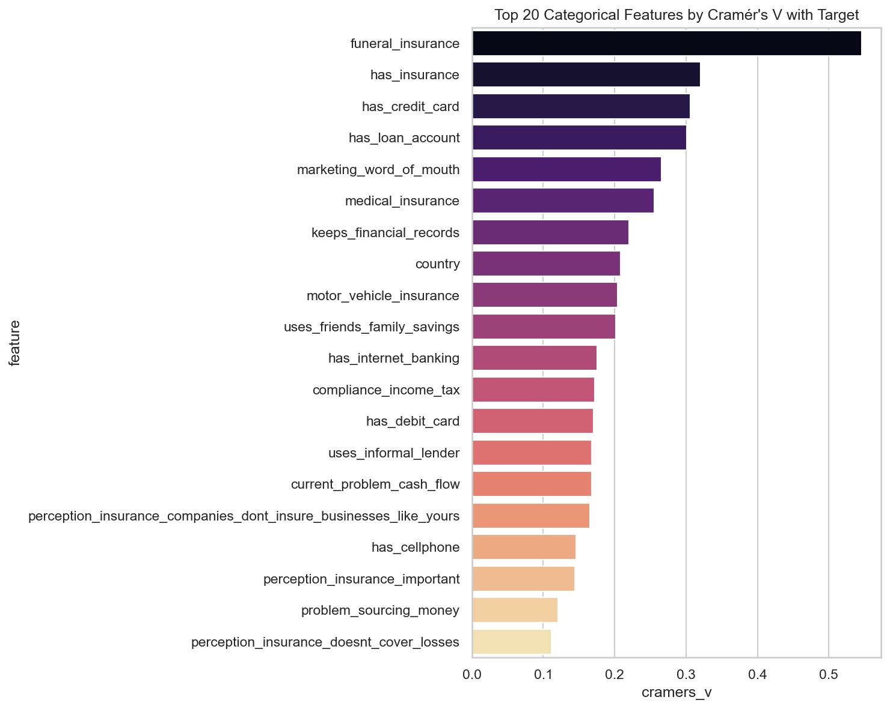
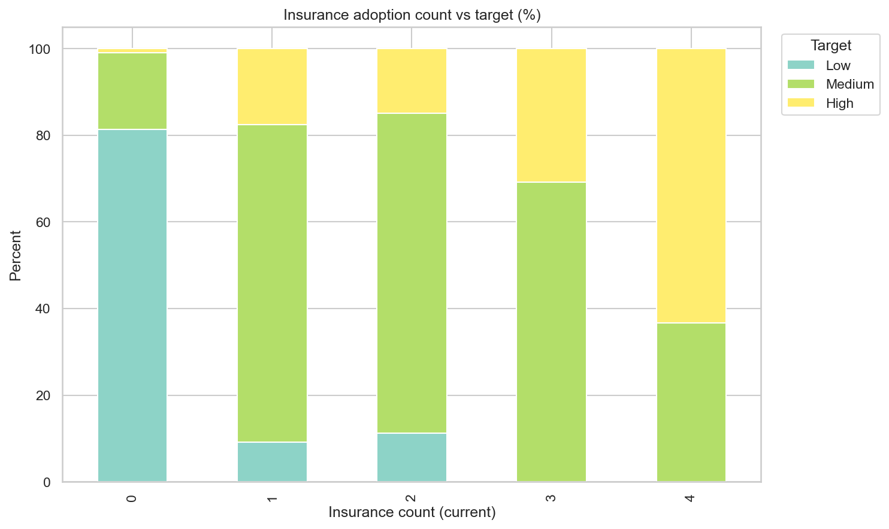
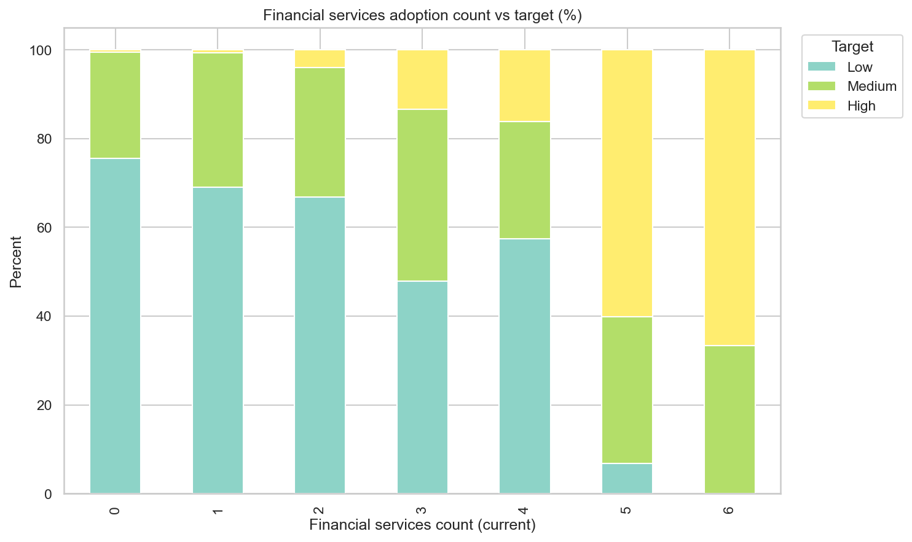
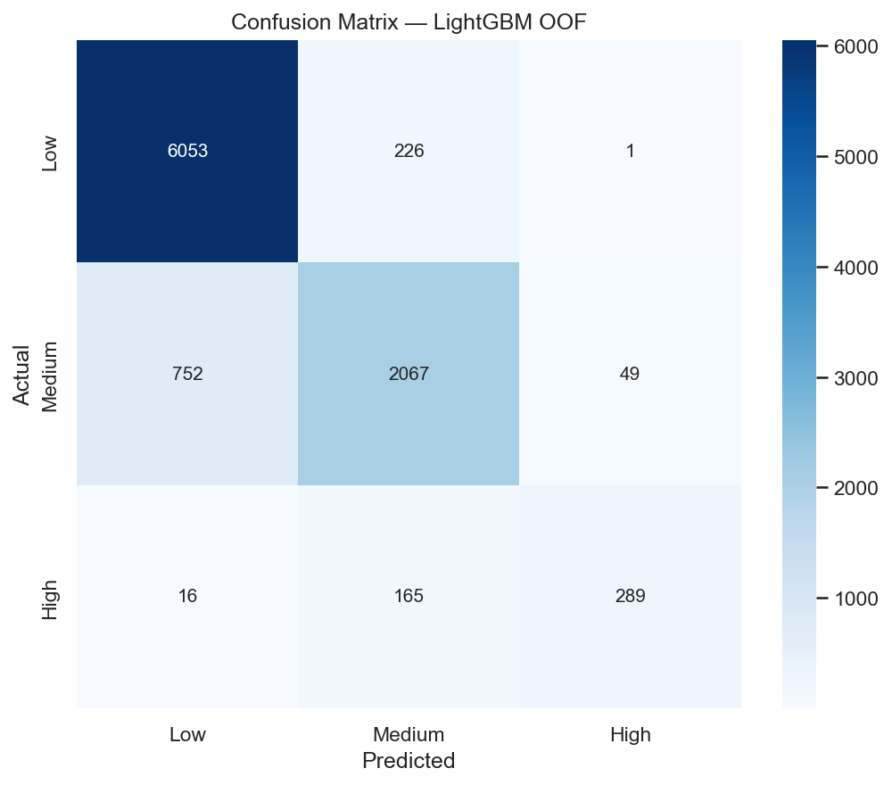
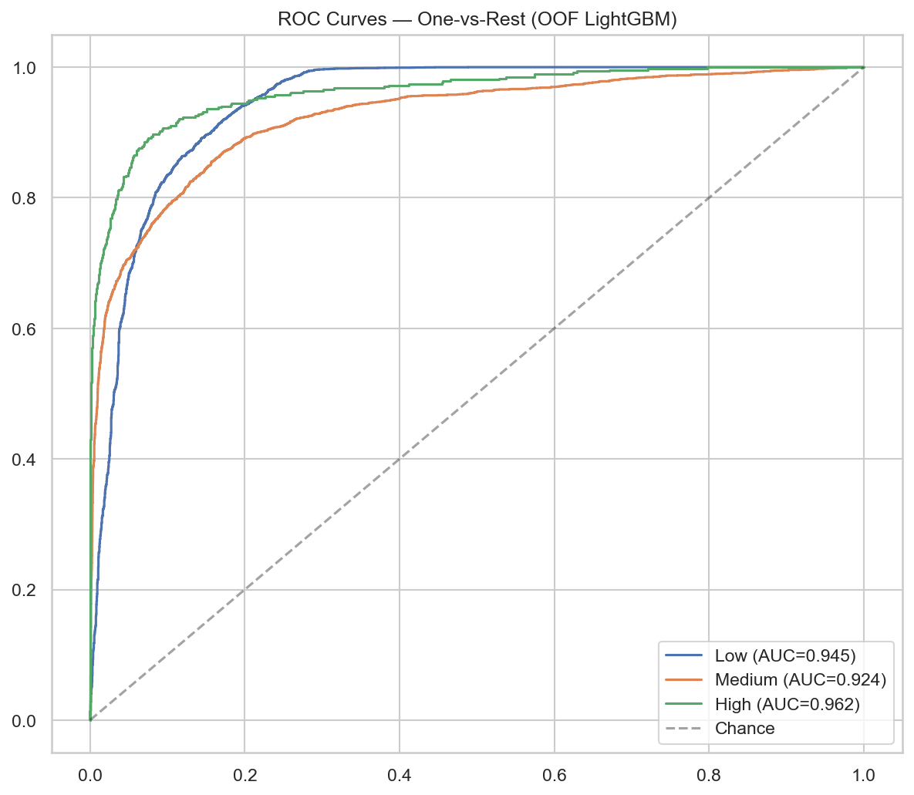

# Exploratory Data Analysis

Research notebook and exported charts for the MSME financial health dataset.

| Item | Path |
|------|------|
| Notebook | [`comprehensive_eda.ipynb`](comprehensive_eda.ipynb) |
| All figures (19) | [`figures/`](figures/README.md) |
| Decision summary | [`decision_parameters_summary.csv`](decision_parameters_summary.csv) |

---

## Findings at a glance

| Finding | Detail |
|---------|--------|
| Strongest categorical predictor | `funeral_insurance` (Cramér's V ≈ 0.55) |
| Top mutual information feature | `funeral_insurance` (MI ≈ 0.22) |
| Class imbalance | ~13:1 max/min class ratio |
| Insurance adoption | Higher current insurance count aligns with Medium/High targets |
| Financial services | More active products (mobile money, cards, loans) correlate with better health |
| Model benchmark (LightGBM OOF) | Accuracy 0.87, F1 macro 0.80, macro ROC-AUC 0.94 |

---

## Selected charts

### Association strength (Cramér's V)



### Insurance adoption vs target



### Financial services adoption vs target



### Model evaluation (LightGBM, 5-fold OOF)





---

## Rerun behavior

- Plot cells **skip** generation if the PNG already exists in `figures/`.
- The notebook **displays** cached images inline and in section 21 (figure gallery).
- Delete a specific PNG or `decision_parameters_summary.csv` to force regeneration.

```bash
cd financial-prediction-model
python -m jupyter notebook eda/comprehensive_eda.ipynb
```
